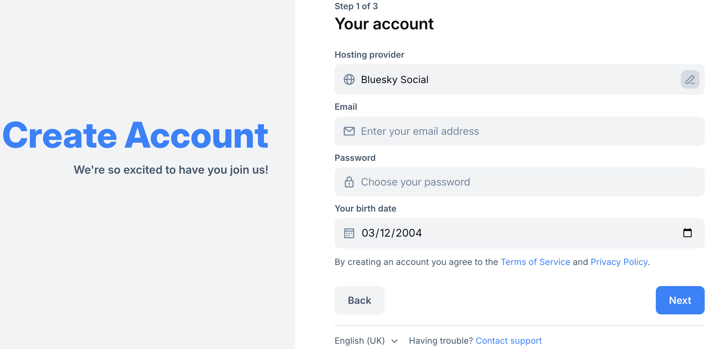
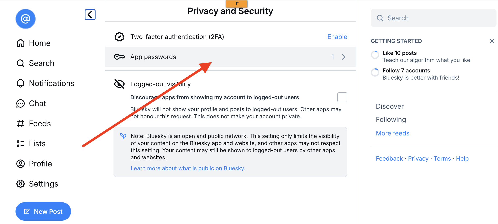
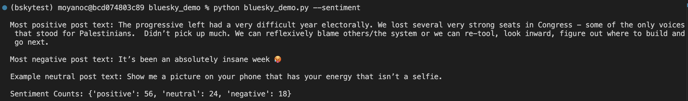
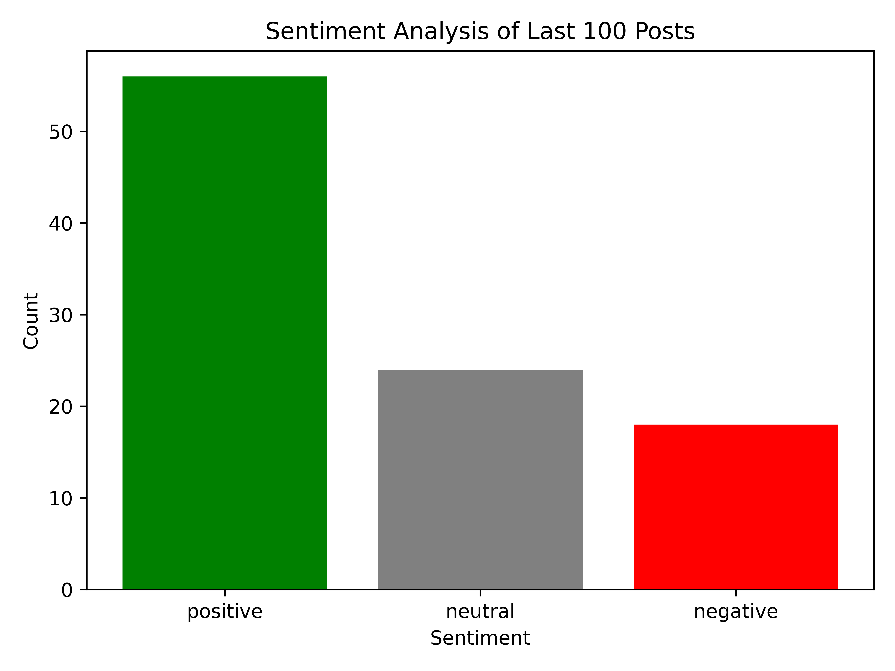
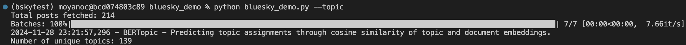
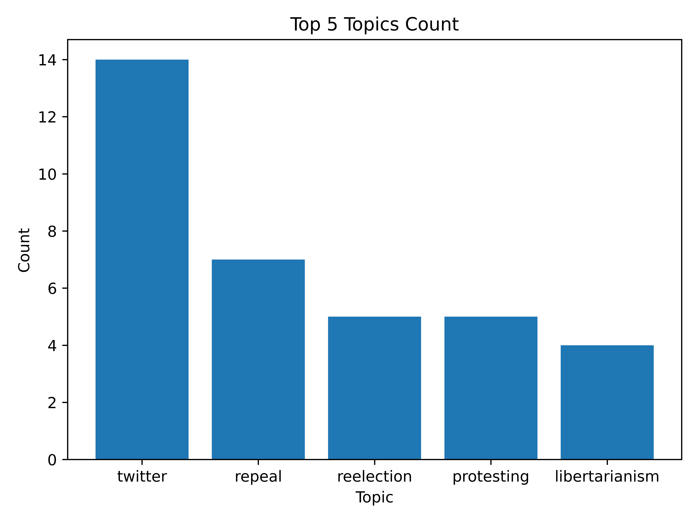

# Bluesky Demo : Consuming posts and applying NLP techniques
## Author: Carlos Moyano

## What is Bluesky?
Bluesky is a decentralized social media platform built on the AT Protocol, designed to give users more control over their data, algorithms, and content. Unlike centralized platforms like Twitter, Bluesky allows users to choose or build their own servers (“instances”), enabling community-driven moderation and customizable user experiences.

Bluesky aims to foster an open ecosystem by separating the app (Bluesky, [link](https://bsky.app/)) from the underlying protocol (AT Protocol, [link](https://atproto.com/)), making it possible for other apps to connect and share data across the network. Currently, Bluesky is invite-only and ad-free, focusing on scalability and sustainable development before broader public access.

## What is the AT Protocol?
The AT Protocol is a decentralized, open-source framework for social networking. It enables account portability (users can move their data between servers), supports algorithmic choice (customizable content feeds), and allows composable moderation (flexible content control across servers). It fosters interoperability, meaning platforms built on the protocol can communicate seamlessly. It uses a combination of various technologies to achieve these goals:

1. Authenticated Transfers
* Identity Layer: The protocol enables a user-centric identity system, where users own their accounts across different servers, defined by unique handle-based addresses (e.g., @username.com). This allows users to switch servers without losing their followers or content.
* Verifiable Credentials: The protocol uses JWT (JSON Web Tokens) for secure and verifiable authentication, ensuring users’ identities are consistent across servers.

2. Federation and Data Portability
* Interoperability: It defines common APIs for federated networks, meaning servers running the protocol can seamlessly exchange data like posts, follows, and mentions, even if they are hosted independently.
* User Data Storage: Data is decentralized but standardized. Each server stores user data locally (on the server it is hosted), but users can easily migrate their data to different servers without disruption.

3. Custom Feeds and Algorithmic Control
* Feed Composition: The protocol allows platforms to offer algorithmic feeds, which can be customized or entirely user-defined. Users can opt into pre-built or third-party algorithms or create their own filters for how content is displayed.

4. Composable Moderation
* Layered Moderation Tools: The AT Protocol supports a flexible moderation system, where server operators and users can apply their own moderation rules (like blocklists, mute lists, or reporting tools). This allows communities to self-organize and adapt their moderation according to their values.

5. API and Data Formats
* The protocol uses standard JSON and RESTful APIs for communication between services. Data is structured in a uniform way to ensure compatibility between platforms. It also enables extensions for new features or protocols without disrupting the existing system.

6. Decentralized Communication
* Federation Layer: The AT Protocol’s federated nature ensures that each instance or server operates independently but can communicate across the network. The protocol uses webhooks and event-driven architecture to notify users of interactions across different servers in real time.

These components make the AT Protocol highly modular, allowing for easier scalability and integration into different platforms while prioritizing user control and privacy

## What does it make it so different from Twitter (X)?

| Feature               | Bluesky                          | X                                |
|-----------------------|----------------------------------|----------------------------------|
| **Architecture**      | Decentralized (AT Protocol)      | Centralized                      |
| **Data Ownership**    | Users own and migrate data       | Controlled by X                  |
| **Feed Algorithms**   | User-customizable                | Proprietary                      |
| **Moderation**        | Community-driven                 | Centralized                      |
| **Revenue Model**     | Free, no ads (currently)         | Ads and paid subscriptions       |
| **Access**            | Open to all                      | Open to all                      |
| **Censorship**        | Flexible (server-specific rules) | Centralized enforcement          |

## Do I have to pay for consuming posts from Bluesky?
No! That's why this tutorial makes sense. In the good old days it was possible to consume data from Twitter with very few restrictions, but it's not the case anymore. By using Bluesky as an alternative, developers, hackers and anybody with basic CS background can start processing textual data, which is a real analytics goldmine.

Bluesky aims to support an open and decentralized ecosystem, with no cost barriers for accessing the API

## Okay... but which are the rates?
Official max rates can be found [here](https://docs.bsky.app/docs/advanced-guides/rate-limits), but a summary is provided below.

* 3K requests per 5 mins per IP address
* ~1.5K posts per hour per account and a max of ~11.5K per day
* 30 sessions per 5 mins and a max of 300 per day
* 100 accounts per minute per IP address

It is possible to run your own Personal Data Server (PDS) as a developer, where your own limits can be applied to hosted accounts.

## Demo

### 1. Create an account

Creating an account in Bluesky is easy and fast. You just need to go to the main webpage ([bsky.app](https://bsky.app/)), follow 3 simple steps, and you'll be able to start using Bluesky!



### 2. Configure an application password
For security reasons, it is better to create an application pasword if you plan to access Bluesky programatically. You can create one by going to ```Settings/Privacity and Security```. Once you're there, click on ```App passwords```.



### 3. Instantiate a client
In order to be able to consume data from Bluesky in Python (or for any other action), it is compulsory to create an instance of the XRPC Client that can navigate the AT Protocol. Once the instance has been created, we need to login using the credentials created in the last step.
```
from atproto import Client

client = Client()
# By default, it uses the server of bsky.app. To change this behavior, pass the base api URL to constructor
# Client('https://example.com')
client.login(handle, password) # Handles are DNS names in the AT Protocol (e.g., XXXX.bsky.social)
```
### 4. Retrieve posts data
The easiest data to retrieve data from a user's feed in Bluesky is by calling the ***get_author_feed()*** method with a DID (see what's that in the AT Protocol: [link](https://atproto.com/specs/did)) and a filter determining the target and the desired type of content, respectively.
```
data = client.get_author_feed(
    actor=target_did
    , filter="posts_and_author_threads"
    , limit=100
)
```
This method offers the possibility of using pagination to retrieve more than *limit* posts. It has a high number of arguments
that can be studied [here](https://atproto.blue/en/latest/atproto/atproto_client.models.app.bsky.feed.get_author_feed.html).

### 5. Extract text from the posts and apply NLP techniques
Once we have extracted text data from Bluesky, we are ready to apply NLP techniques. For the sake of simplicity, in this tutorial we have just focused on two easy tasks:

1. Sentiment analysis using TextBlob (rule-based, [link]())

When we execute ```python bluesky_demo.py --sentiment```, we obtain the following output in the console:



Also, the image below is generated, indicating the count of the last 100 posts of a target Bluesky account that fall into the positive, negative or neutral polarity buckets.



2. Topic modeling using a Transformer model from Hugging Face

When we execute ```python bluesky_demo.py --topic```, we obtain the following output in the console:



Also, the image below is generated, indicating the count of the top 5 topics for all the posts of a target Bluesky account.


